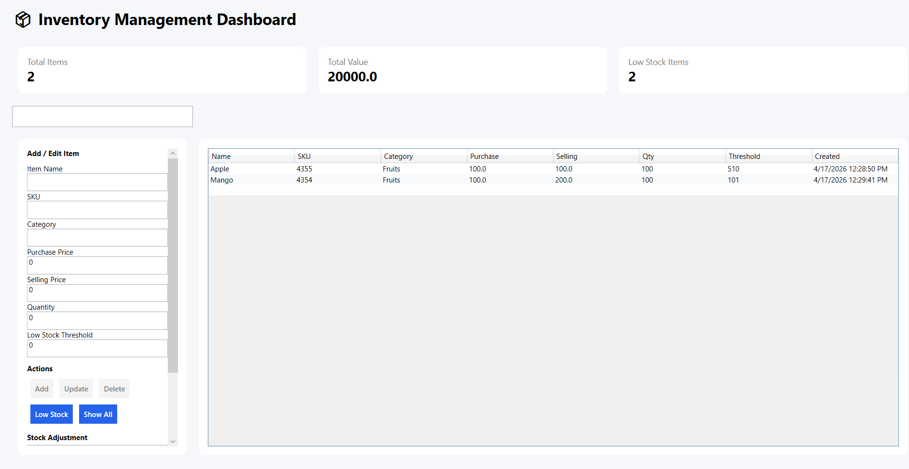
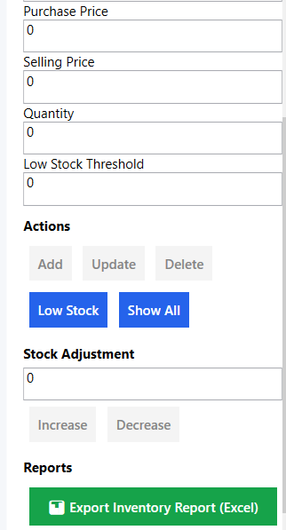

# Inventory Management System (WPF)

## Overview
A desktop application built using C# and WPF for managing inventory, tracking stock, and generating reports. Designed with a structured architecture to simulate real-world business workflows.

## Features
- Add, update, and delete inventory items (CRUD operations)
- Real-time search and filtering
- Stock tracking and transaction logging
- Excel report generation
- Clean UI using WPF (MVVM-inspired structure)

## Tech Stack
- C# (.NET)
- WPF
- Entity Framework Core
- SQLite

## Project Structure
- Models → Data structures
- Data → Database handling
- Commands → Business logic
- Views → UI components

## Use Case
Helps small businesses or internal teams manage inventory efficiently with structured data handling and reporting features.

## How to Run
1. Clone the repository  
2. Open `.sln` file in Visual Studio  
3. Run the project  

## Author
Shahid Saiyed  
MSc AI for Business (London)

## Screenshot

